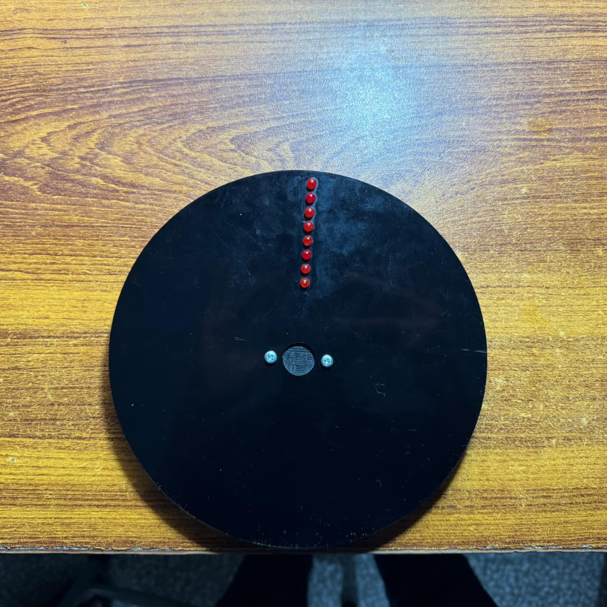

<br/>
Persistence of Vision Display</h3>
ESP32 powered Persistence of Vision Display


  


</p>
</div>

## About The Project



This project aims to Create a rotating word display using an array of eight LEDs Powered by an ESP32 microcontroller.


### Built With

- [Arduino IDE](https://www.arduino.cc/en/software/)
- [Fusion](https://www.autodesk.com/products/fusion-360/overview)
## Getting Started

The assembly consists of two disks, one stationary and one rotating. Two Neodymium magnets are placed on the stationary disk, 144 degrees apart, which acts as the trigger angle and sets the output window size. The magnets are placed with opposite poles facing outward. A bipolar hall effect latch is used to detect the alternating magnetic field and enable/ disable the LED array as well as calculate disk RPM.

The rotating disk is divided into 60 columns which gives,

$$ {144 \over 360} ]\times 60 = 24 $$

columns available for display. This can be changed by editing:
```sh
   #define NUM_COLS  23
   ```   
To change window size:
```sh
   #define ACTIVE_FRAC 0.4f
   ``` 


In [Encoding.xlsx](https://github.com/jollyjester9/PoV-Display/blob/main/Encoding.xlsx), each character takes 5 columns so by default, a four character expression is supported with 1 column acting as spacing between characters.

The characters are stored as hex values, for example, 'V' is stored as;
```sh
   const uint8_t CHAR_V[5] = {0x07, 0x38, 0xC0, 0x38, 0x07};
   ```

The 
### Prerequisites

This is an example of how to list things you need to use the software and how to install them.

- npm
  ```sh
  npm install npm@latest -g
  ```
### Installation

_Below is an example of how you can instruct your audience on installing and setting up your app. This template doesn't rely on any external dependencies or services._

1. Get a free API Key at [https://example.com](https://example.com)
2. Clone the repo
   ```sh
   git clone https://github.com/your_username_/Project-Name.git
   ```
3. Install NPM packages
   ```sh
   npm install
   ```
4. Enter your API in `config.js`
   ```js
   const API_KEY = "ENTER YOUR API";
   ```
## Usage

Use this space to show useful examples of how a project can be used. Additional screenshots, code examples and demos work well in this space. You may also link to more resources.

_For more examples, please refer to the [Documentation](https://example.com)_
## Roadmap

- [x] Add Changelog
- [x] Add back to top links
- [ ] Add Additional Templates w/ Examples
- [ ] Add "components" document to easily copy & paste sections of the readme
- [ ] Multi-language Support
  - [ ] Chinese
  - [ ] Spanish

See the [open issues](https://github.com/ShaanCoding/ReadME-Generator/issues) for a full list of proposed features (and known issues).
## Contributing

Contributions are what make the open source community such an amazing place to learn, inspire, and create. Any contributions you make are **greatly appreciated**.

If you have a suggestion that would make this better, please fork the repo and create a pull request. You can also simply open an issue with the tag "enhancement".
Don't forget to give the project a star! Thanks again!

1. Fork the Project
2. Create your Feature Branch (`git checkout -b feature/AmazingFeature`)
3. Commit your Changes (`git commit -m 'Add some AmazingFeature'`)
4. Push to the Branch (`git push origin feature/AmazingFeature`)
5. Open a Pull Request
## License

Distributed under the MIT License. See [MIT License](https://opensource.org/licenses/MIT) for more information.
## Contact

Your Name - [@your_twitter](https://twitter.com/your_username) - email@example.com

Project Link: [https://github.com/your_username/repo_name](https://github.com/your_username/repo_name)
## Acknowledgments

Use this space to list resources you find helpful and would like to give credit to. I've included a few of my favorites to kick things off!


- [makeread.me](https://github.com/ShaanCoding/ReadME-Generator)
- [othneildrew](https://github.com/othneildrew/Best-README-Template)
