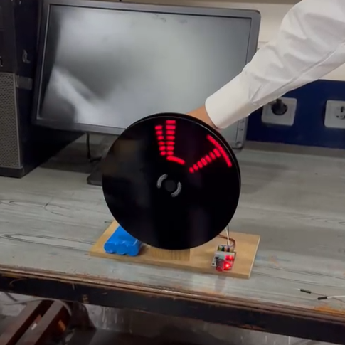
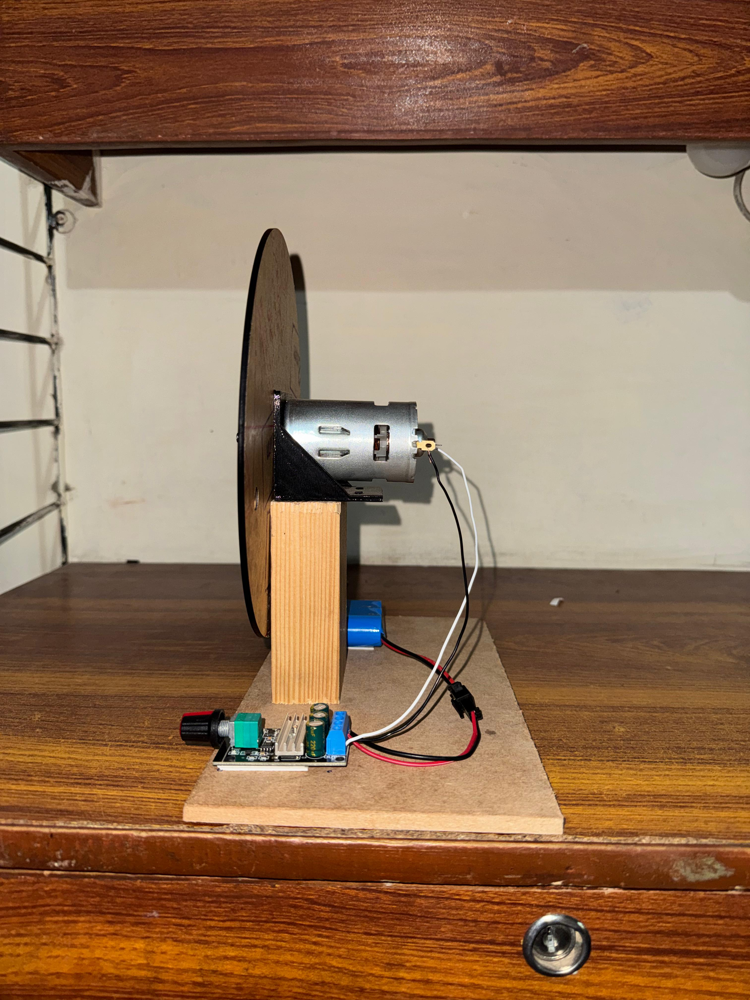

<br/>
<div align="left">

<h2 align="left">Peristance of Vision Display</h2>
<p align="left">
ESP32 powered PoV Display


  


</p>
</div>



## About The Project

This project aims to Create a rotating word display using an array of eight LEDs Powered by an ESP32 microcontroller.

## Components/ Parts List

### Off the shelf:
- ESP32 Dev Board
- RS-775 Motor
- PWM Dimmer
- 11.1 Volt Lithium Battery
- 4.8 Volt Lithium Battery
- M4*12 screws x 4
- M3*4 screws x 4
- SS41F Hall Effect Sensor
- 5mm LEDs (Red) x 8
- 330 ohm resistor x 8
- 10 kilo ohm resistor x 1

### Custom:
- Motor Mount
- Motor Adapter
- ESP Mount
- Rotating Disk
- Stationary Disk

## Built With

- [Arduino IDE](https://www.arduino.cc/en/software/)
- [Fusion](https://www.autodesk.com/products/fusion-360/overview)

## Hardware assembly

The assembly consists of two disks, one stationary and one rotating. Two Neodymium magnets are placed on the stationary disk, 144 degrees apart, which acts as the trigger angle and sets the output window size. The magnets are placed with opposite poles facing outward. A bipolar hall effect latch is used to detect the alternating magnetic field and enable/ disable the LED array as well as calculate disk RPM.

### Stationary Disk:


### Rotating Disk:


The rotating disk is divided into 60 columns which gives, the number of columns available for display are:


$${144 \over 360} \times 60 = 24$$


The Rotating disk is spun using an RS-775 motor, a PWM dimmer is used to control motor RPM;



## Code overview

To change display resolution, edit:
```sh
   #define NUM_COLS  23
   ```   
To change window size, edit (note: this will require changing magnet spacing on the stationary disk)
```sh
   #define ACTIVE_FRAC 0.4f
   ```

In [Encoding.xlsx](https://github.com/jollyjester9/PoV-Display/blob/main/Encoding.xlsx), each character takes 5 columns so by default, a four character expression is supported with 1 column acting as spacing between characters.

The characters are stored as hex values, for example, 'V' is stored as;
```sh
   const uint8_t CHAR_V[5] = {0x07, 0x38, 0xC0, 0x38, 0x07};
   ```

The code iterates through all 24 columns, updates the current columns and outputs the corresponding 8 bit value to the LEDs
